# BIBLE APP

## First delivery (28/11/2022)
This application serves the function of saving and showing bible verses created by the user.
During the development of this version, we have worked with:
- Activities
- Fragments
- Basic interface elements like EditText, Label, Button and TextView
- SQLite (insert, delete and select)
- Recycler View
- Alert Dialog

### App tour

#### Login
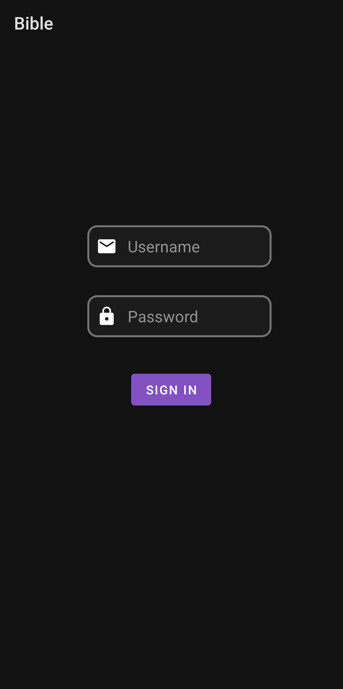

> When you open the app, the first you see is the Login Activity. You must use **admin** for the username field and **admin** for the password field to log in correctly. If done, you will go to the Bottom Navigation Activity, and a *Login successful* Toast will appear. If the fields are not these, a *Login unsuccessful* Toast will show. On both cases, username and password fields will be cleared.

 

#### Home
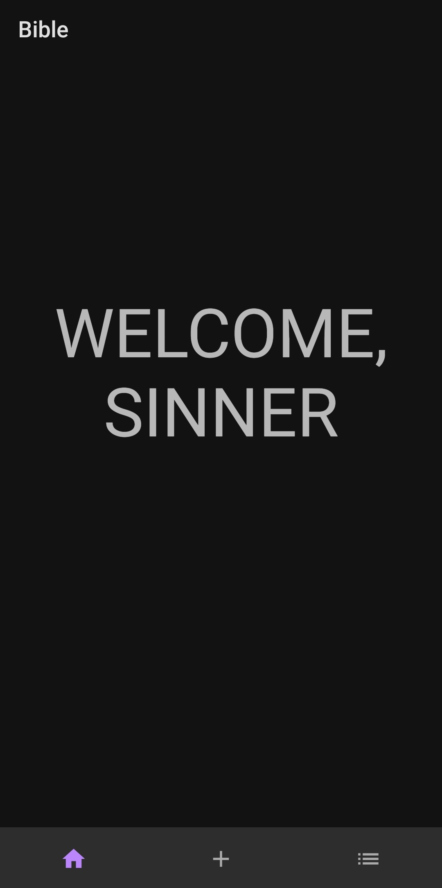

> The first Fragment that will load after the login is Home. Right now, is just a basic text welcoming the user. To change the active Fragment, there is a Bottom Navigation Menu at the bottom, with three possible options: Home, Form and List.

 

#### Form

  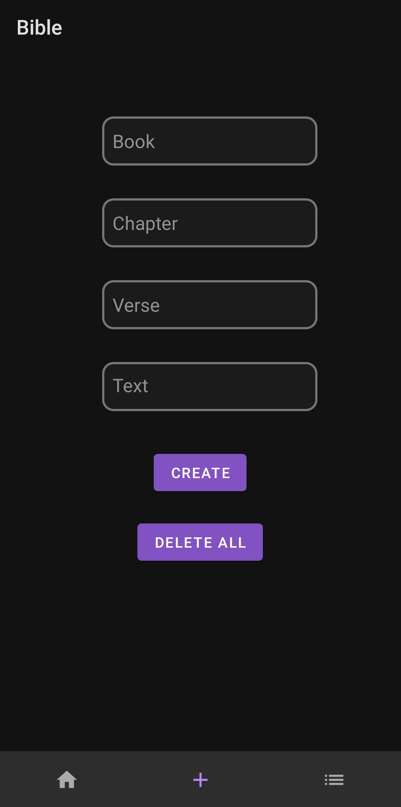
  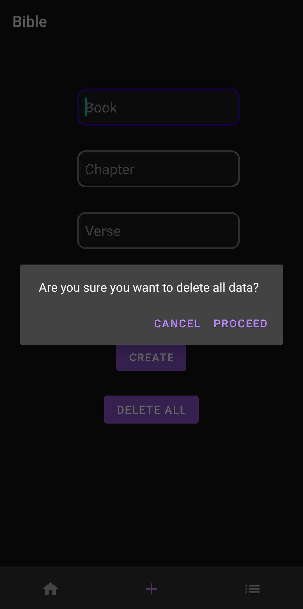

> The Form Fragment allows the user the possibility of adding new verses to the list. The user must specify four fields: Book, Chapter, Verse and Text. Chapter and Verse must be numbers, so the keyboard for these fields must appear different, with just number buttons. When trying to create clicking the button, if all fields are filled a Toast will show saying that the creation has been successful. But if some field is empty, the verse will not be added and a Toast will notify it. As the Text field might be long, the input container will grow as text is being written. At the bottom, there's also a button to delete all verses from the list. When clicked, a dialog menu will appear, and the user will have to confirm the decision of deleting all data. Whatever the choice is, a Toast will show with a message.

 

#### List

  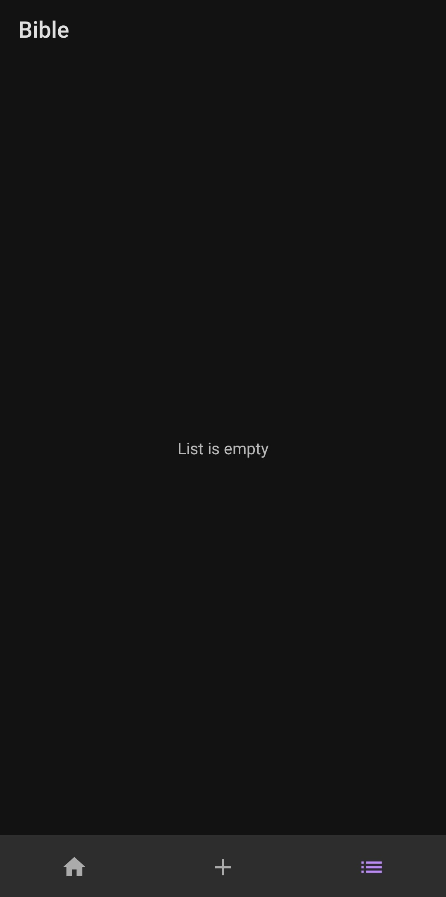
  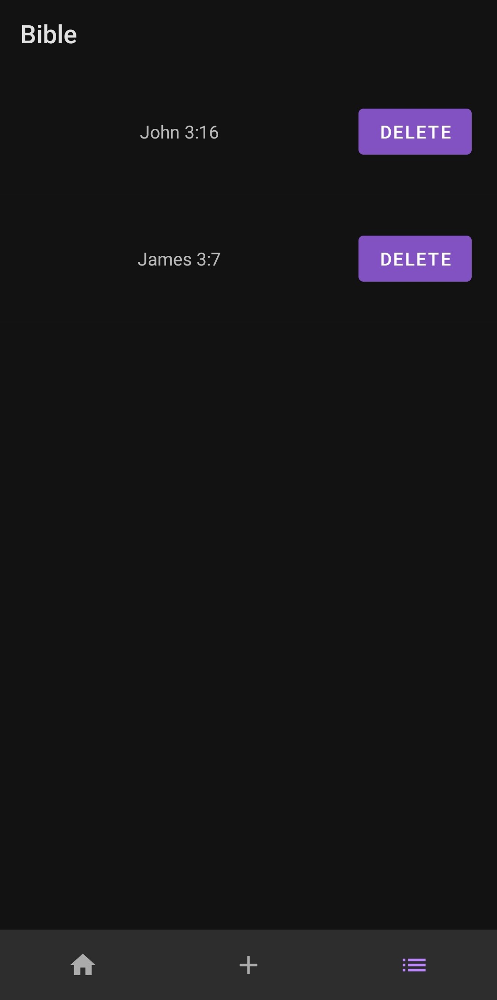

> The List Fragment uses a Recycler View to display a list of all the verses, but if the list is empty, a *List is empty* placeholder is shown instead. Every item of the list will correspond to a verse from the database. The title will be shown, formed by the Book, the Chapter and the Verse. There will be a **Delete** button as well. Like on the **Delete all** button from the form, a dialog menu will show to confirm the action. If an element is clicked, the Detail Fragment of that verse will be loaded.

 

#### Detail
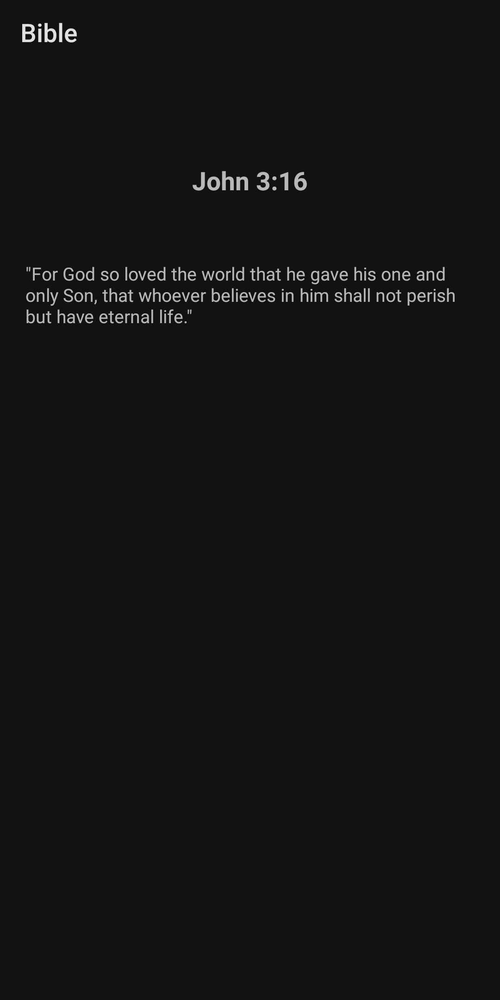

> The Detail Fragment is very basic, with a title with the same format from the one on the Recycler View item, and after that the text from the verse is shown. Both TextViews are formatted so multiple-line text is allowed, with paddings on the left and right. On this Fragment, the Bottom Navigation Menu is hidden, and to go back to the List, the back button from the phone must be clicked. Obviously, when that is done, the Bottom Navigation Menu is available again.

 

## Second delivery (21/12/2022)
During the development of this version, we have worked with:
- Shared Preferences
- Multi Language

#### Login
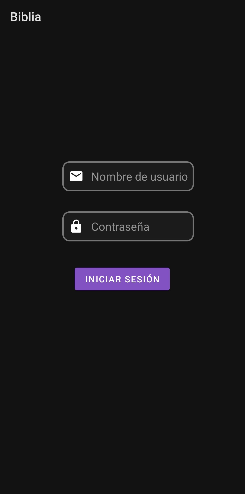

> When you log in correctly, a Shared Preference is saved, so next time you open the app, it automatically logs in and goes to Home. Here is also where the language saved on the SHared Preferences is loaded when opening the app.

 

#### Settings

  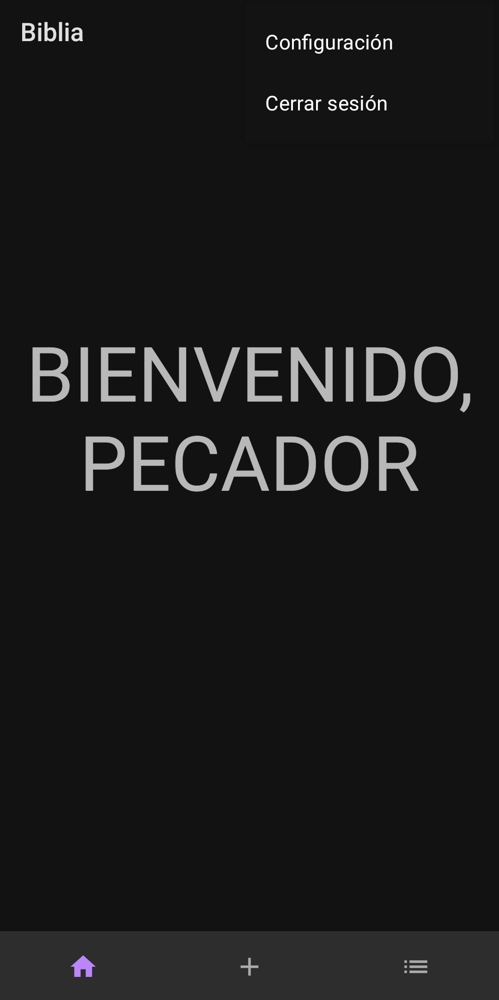
  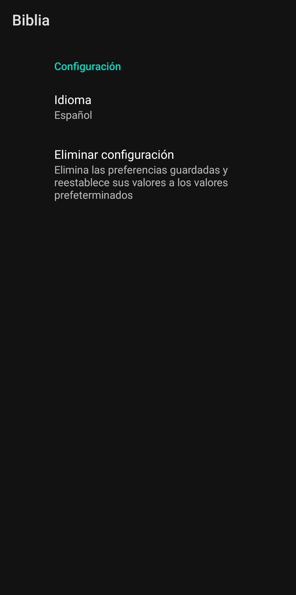

> On any Fragment from the Bottom Navigation Activity, there's now a menu at the top right corner. It has two items: Settings and Logout. If you click on Logout, you get back to the Login screen and the automatic log in is deleted from the Shared Preferences. If you click on Settings, a new Fragment appears called Settings Fragment. There, you can choose a language (English, Spanish and Catalan), and you can delete all Shared Preferences.

 

#### List
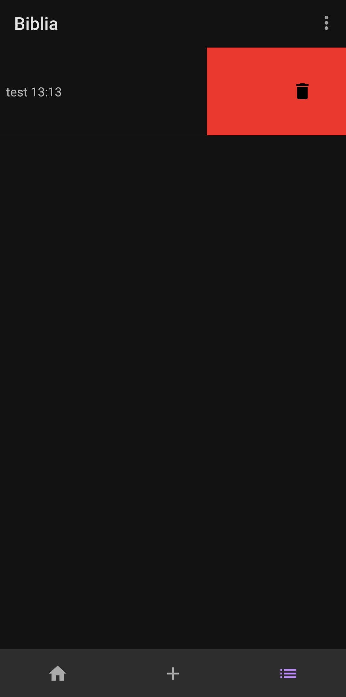

> On the Recycler View, the button to delete an item has been replaced with a Swiper. Now if you want to delete a verse, you must swipe it to the left, and a dialog will appear as before.

 

## Third delivery (23/01/2023)
During the development of this version, we have worked with:
- Retrofit

#### Home
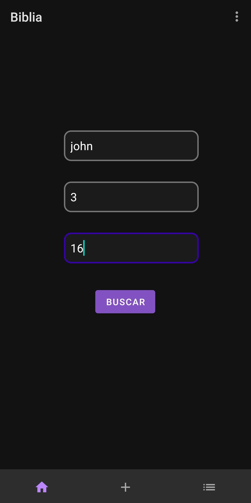

> The Home Fragment has been redesigned. Now it has a form to search for existing verses from the open API https://bible-api-com/. If all fields are filled and the request returns a verse, a Detail Fragment will open. If the request doesn't find a verse with these parameters, a toast is shown indicating that the verse was not found. If any field is not filled, a toast is shown requesting to do so.

 

#### Detail
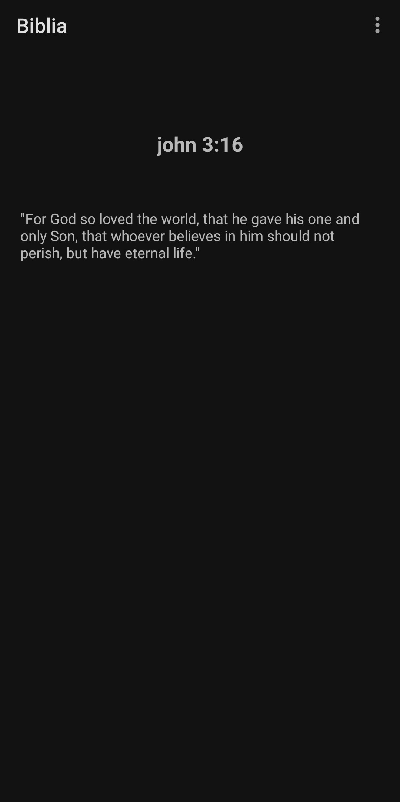

> A Detail Fragment is loaded with the text obtained from the request to the bible-api. The other fields (book, chapter and verse) are reused from the fields filled by the user on the Home Fragment.